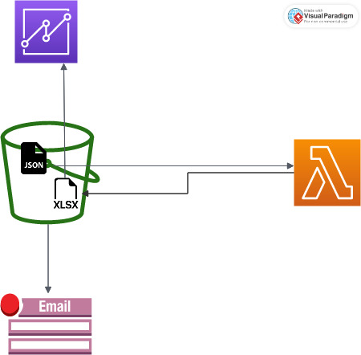

# JSON_scrapper
# Terraform AWS Configuration

This Terraform configuration sets up an AWS infrastructure for a data processing pipeline. The configuration includes the creation of an S3 bucket, an AWS Lambda function, and necessary IAM policies and permissions.

## Prerequisites

Before using this Terraform configuration, make sure you have the following prerequisites installed on your system:

- [Terraform](https://www.terraform.io/)
- AWS CLI configured with appropriate credentials

## Overview

This Terraform configuration creates an AWS infrastructure to set up a data processing pipeline. The key components of this configuration include:

- An S3 bucket (`aws_s3_bucket.data_bucket`) for storing data files.
- An AWS Lambda function (`aws_lambda_function.jsonParse`) to process the data.
- IAM policies and permissions to grant the Lambda function access to necessary AWS services.

## Getting Started

### Installation

Follow these steps to apply the Terraform configuration:

1. Clone this repository:

2. Navigate to the project directory
3. Initialize the Terraform workspace:

    ```bash
        terraform init

4. Apply the configuration:

    ```bash
        terraform apply



## Use Case
The serverless infrastructure allows us to upload a JSON file onto an S3 bucket that triggers a lambda process which converts the JSON file into a CSV using python and its libraries. The report that is genrerated is send back to the bucket that will let us use a service like quicksight in order for us to view the report generated and the lambda function will trigger a SNS topic upon completing with a email notification of the invocation.

## Improvements

- A good change would be to have seperate buckets for the files, so as to avoid errors, reccursion and security purposes. 
- Addding more context to the SNS topic email could help us further understand the situation
- The python code to convert the JSON in quite elementary and could be updated to let us have better reports however it depends if we have a fixed schema or not and would change accordingly
